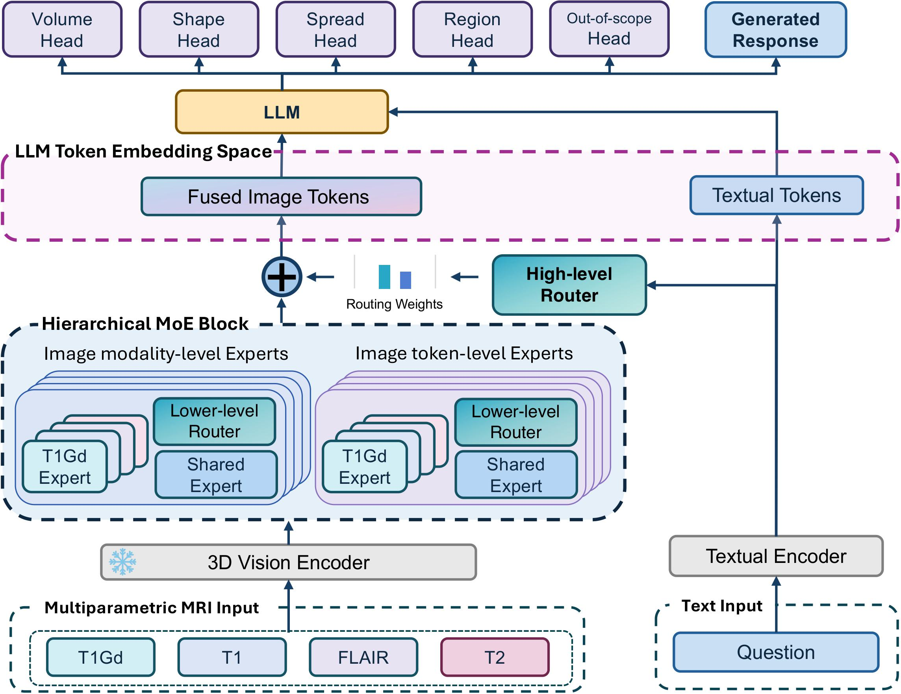

# Multimodal LLM with Hierarchical Mixture-of-Experts for VQA on 3D Brain MRI

This is the official implementation for the paper "Multimodal LLM with Hierarchical Mixture-of-Experts for VQA on 3D Brain MRI". In our work, we propose mpLLM, a novel multimodal LLM architecture that utilizes 
hierarchical mixture-of-experts (MoE) to process multiple interrelated 3D image modalities. We also propose a novel a synthetic VQA protocol that generates medically relevant visual question answering (VQA) data utilizing existing large, publicly available segmentation mpMRI datasets.

<p align="center">
  
</p>

## Usage
1. Make sure `conda` or `virtualenv` is installed and create a virtual environment and install 
the libraries in `requirements.txt` (we tested with the latest version of python 3.9)
```
pip install -r requirements.txt
```
2. Download the BraTS-GLI, BraTS-MET, and BraTS-GoAT from the official website and run 
`prepare_brats_3d_dataset.py` to convert the data into npy format (make sure to change paths).

3. While we do not provide the VQA data at this time, you may provide a json file, in which there a list of dicts in the 
following format
```
  {
    "question": (question text),
    "answer_vqa": (list of answers, contained in brackets, corresponding to each integer in combo)
    "answer_gen": (answer text),
    "type": (question type - options are area, region, shape, satellite, partially_unknown, and unknown),
    "label_name": (question type - options are),
    "volume_file_id": (id is associated with volume - unique to volume),
    "volume_file_dir": (directory associated with medical volume),
    "volume_seg_file": (segmentation volume file),
    "volume_non_seg_files": {"t1c": (t1c file), "t1n": (t1n file), "t2w": (t2w file), "t2f": (t2f file)},
    "img_id": (id is associated with img - unique to volume),
    "q_lang": "en",
    "qid": (unique id associated with question)
    "location": "Brain",
    "answer_type": "OPEN",
    "base_type": "VQA",
    "content_type": (same as type),
    "study_name": (study associated with volume),
    "answer": (answer text same as answer_gen),
    "combo": (subset of [1,2,3,4,5], 1=area, 2=region, 3=shape, 4=satellite, 5=unknown),
    "answer_vqa_numeric": (list of numeric answers for area, region, shape, satellite, and unknown. Ff the question type is not provided, then 0 is provided. The numeric answer for region is also a list.)
  }
```
More details about the dataset release are forthcoming.

4. In our experiments, we use the image encoder from `https://github.com/BAAI-DCAI/M3D` and specify the location of the saved encoder in `vision_model_name` in the yaml file (the yaml files are described in more detail below).

5. To train our model, we have three scripts corresponding to the three datasets: `run_med_3d_llm_brats.py`,  `run_med_3d_llm_brats_met.py`, and `run_med_3d_llm_brats_goat.py`. We have also provided the token-level and modality-level moe versions of the model (without prompt-based routing) in `yaml/med_3d-llm_params_brats1.yml` and `yaml/med_3d-llm_params_brats2.yml` respectively for comparison. The eval scripts can be run with `run_med_3d_llm_brats_eval.py`, `run_med_3d_llm_brats_met_eval.py`, and `run_med_3d_llm_brats_goal_eval.py`. You may want to modify these scripts based on your provided data. Run the below command to run the scripts. 
```
PYTHONPATH=. python run/<run_script>
```

## Experiment Parameters
The `yaml` directory contains yaml files associated with different model configuration runs.
In general, there are `exp` parameters like `output_dir` which specifies the output directory for the
experiment. Additionally, there are `data`, `train`, and `inf` parameters which specify the data,
train, and inference parameters respectively.

Please look at the associated model trainer classes to see how these parameters are used. 
For reference, the relevant trainer classes for our work are `model/medical_3D_llm_trainer.py`, 
`model/vision_to_llm_trainer.py`, and `model/llm_trainer.py`. The relevant models are 
`model/vision_3D_language_model.py` and `model/vision_language_model.py`. Our implementation of the 
Hierarchical MoE is contained in `model/moe_block.py` and `model/higher_level_moe_block.py`,  if you 
would like to inspect the code.

## Evaluation Code
The metric evaluation script is found in `data/llm_eval_multitask.py`. Please provide the multitask prediction  file, the ground truth file, and the output file.

## Citation

If you use this code in your research, please cite the following:

```
@article{vepa2025multimodal,
  title        = {A Multimodal LLM Approach for Visual Question Answering on Multiparametric 3D Brain MRI},
  author       = {Vepa, Arvind Murari and Yu, Yannan and Gan, Jingru and Cuturrufo, Anthony and Li, Weikai and Wang, Wei and Scalzo, Fabien and Sun, Yizhou},
  journal      = {arXiv preprint arXiv:2509.25889},
  year         = {2025},
  month        = {Oct},
  note         = {23 pages, 3 figures},
  url          = {https://arxiv.org/abs/2509.25889}
}
```